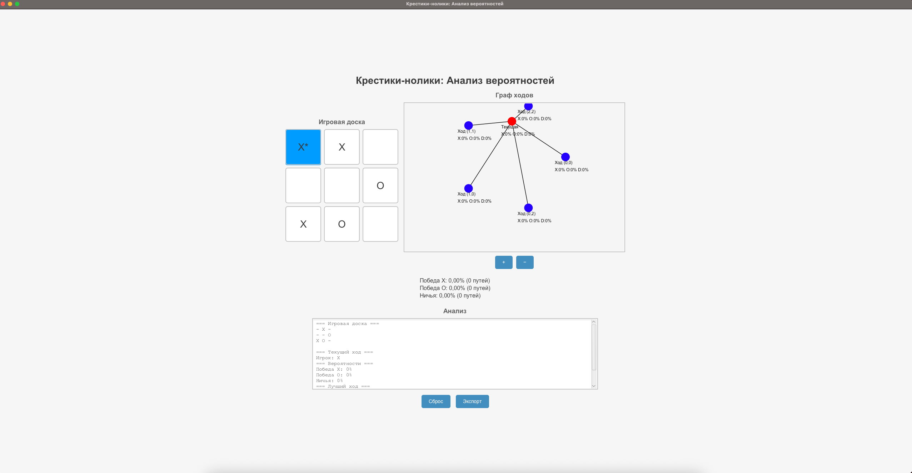

# Tic-Tac-Toe Probability Analyzer

This project implements a Tic-Tac-Toe game with probability analysis and visualization using JavaFX. It allows players to make moves, analyzes the game state, and visualizes a probability graph of possible outcomes.

## Features

- Play Tic-Tac-Toe with X and O players.
- Analyze game state with win probabilities for X, O, and draw.
- Visualize a probability graph using JavaFX.
- Highlight best moves and winning lines.
- Export game analysis to a text file.

## Technologies

- Java 23
- JavaFX 24.0.1
- Maven

## How to Run

### Prerequisites:
- Install Java 23 (e.g., Amazon Corretto: Adoptium).
- Download JavaFX 24.0.1 SDK for macOS aarch64: GluonHQ.
- Install Maven.

### Steps:
1. Clone the repository:
   ```bash
   git clone https://github.com/SergPronin/algorithms-and-data-structures/tree/main/game-analyze
   ```
2. Navigate to the project directory:
   ```bash
   cd game-analyze
   ```
3. Build the project:
   ```bash
   mvn clean install
   ```
4. Run the application:
   ```bash
   mvn javafx:run
   ```
5. Alternatively, run in IntelliJ IDEA with VM options:
   ```bash
   --module-path /Users/sergejpronin/javafx-sdk-24.0.1/lib --add-modules javafx.controls,javafx.fxml
   ```

## Project Structure

```
src/
├── main/java/ru/vsu/cs/course1/
│   ├── Main.java              # Entry point
│   ├── controller/
│   │   └── GameController.java  # Game logic and UI control
│   ├── model/
│   │   ├── Board.java         # Game board model
│   │   ├── Graph.java         # Probability graph
│   │   ├── MoveAnalysis.java  # Move analysis
│   │   ├── Node.java          # Graph node
│   │   └── Probability.java   # Probability calculations
│   ├── utils/
│   │   └── ResultExporter.java  # Export functionality
│   └── view/
│       ├── GraphVisualizer.java  # Graph visualization
│       └── MainView.java     # Main UI
├── resources/
│   └── style.css             # CSS styles
```

## Screenshots




## License

MIT License (see LICENSE)

# Анализатор Вероятностей Крестики-Нолики

Этот проект реализует игру Крестики-Нолики с анализом вероятностей и визуализацией с помощью JavaFX. Игроки могут делать ходы, а система анализирует текущее состояние игры и визуализирует граф вероятных исходов.

## Возможности

- Игра в Крестики-Нолики для игроков X и O.
- Анализ состояния игры с вероятностями победы для X, O и ничьей.
- Визуализация графа вероятностей с помощью JavaFX.
- Подсветка лучших ходов и выигрышных линий.
- Экспорт анализа в текстовый файл.

## Технологии

- Java 23
- JavaFX 24.0.1
- Maven

## Как Запустить

### Предварительные требования:
- Установите Java 23 (например, Amazon Corretto: Adoptium).
- Скачайте JavaFX 24.0.1 SDK для macOS aarch64: GluonHQ.
- Установите Maven.

### Шаги:
1. Склонируйте репозиторий:
   ```bash
   git clone https://github.com/SergPronin/algorithms-and-data-structures/tree/main/game-analyze
   ```
2. Перейдите в папку проекта:
   ```bash
   cd game-analyze
   ```
3. Соберите проект:
   ```bash
   mvn clean install
   ```
4. Запустите приложение:
   ```bash
   mvn javafx:run
   ```
5. Альтернативно, запустите в IntelliJ IDEA с опциями VM:
   ```bash
   --module-path /Users/sergejpronin/javafx-sdk-24.0.1/lib --add-modules javafx.controls,javafx.fxml
   ```

## Структура Проекта

```
src/
├── main/java/ru/vsu/cs/course1/
│   ├── Main.java              # Точка входа
│   ├── controller/
│   │   └── GameController.java  # Логика игры и управление UI
│   ├── model/
│   │   ├── Board.java         # Модель игровой доски
│   │   ├── Graph.java         # Граф вероятностей
│   │   ├── MoveAnalysis.java  # Анализ ходов
│   │   ├── Node.java          # Узел графа
│   │   └── Probability.java   # Расчёт вероятностей
│   ├── utils/
│   │   └── ResultExporter.java  # Функционал экспорта
│   └── view/
│       ├── GraphVisualizer.java  # Визуализация графа
│       └── MainView.java     # Основной UI
├── resources/
│   └── style.css             # Стили CSS
```


Лицензия MIT (см. LICENSE)