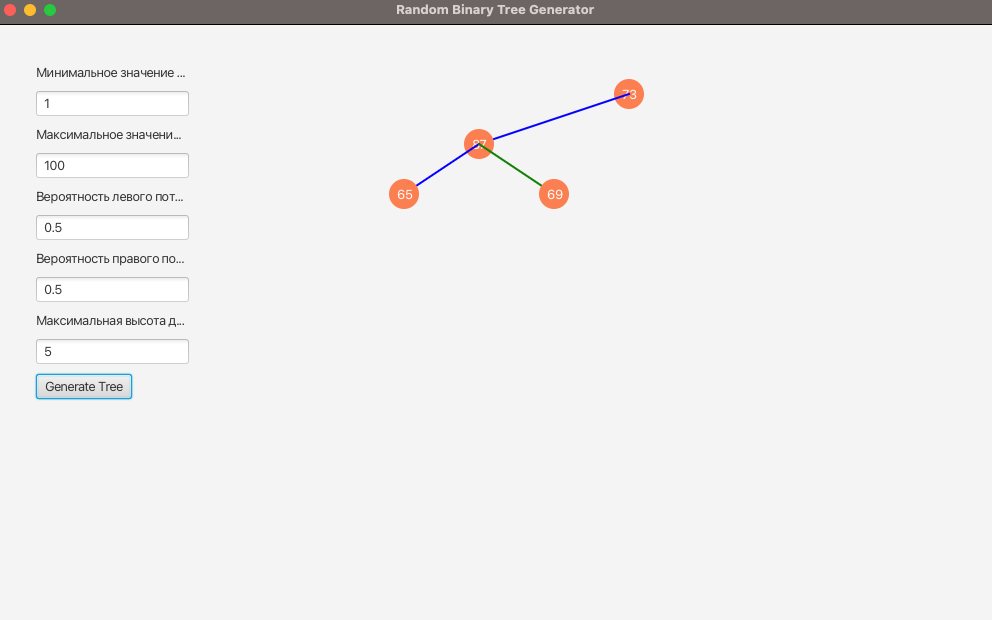

# Random Binary Tree Generator

This project implements a random binary tree generator with visualization using JavaFX. It allows generating trees with custom parameters and visualizing them either with fixed settings or through an interactive GUI. Created as of 07:28 PM +04, May 28, 2025.

## Features
- Generate random binary trees with:
    - Custom node value range (`minValue` to `maxValue`).
    - Probabilities for left and right children (`leftP`, `rightP`).
    - Maximum tree height (`maxHeight`).
- Visualize trees using JavaFX with an interactive GUI.
- Unit tests with JUnit 5 to verify tree generation.

## Technologies
- Java 23
- JavaFX 24.0.1
- Maven
- JUnit 5

## How to Run
1. **Prerequisites**:
    - Install Java 23 (e.g., Amazon Corretto: [Adoptium](https://adoptium.net/)).
    - Download JavaFX 24.0.1 SDK for macOS aarch64: [GluonHQ](https://gluonhq.com/products/javafx/).
    - Install Maven.
2. Clone the repository:
   ```bash
   git clone https://github.com/your-username/java-binary-tree.git
   ```
3. Navigate to the project directory:
   ```bash
   cd java-binary-tree
   ```
4. Build the project:
   ```bash
   mvn clean install
   ```
5. Run the interactive visualizer:
   ```bash
   mvn javafx:run
   ```
6. Alternatively, run in IntelliJ IDEA with VM options:
   ```bash
   --module-path /Users/sergejpronin/javafx-sdk-24.0.1/lib --add-modules javafx.controls,javafx.fxml
   ```

## Project Structure
```
src/
├── main/java/ru/vsu/cs/course1/
│   ├── RandomBinaryTree.java      # Generates random binary trees
│   ├── TreeNode.java             # Node class for binary trees
│   ├── TreeVisualizer.java       # Visualizes a tree with fixed parameters
│   ├── TreeVisualizerWithInput.java  # Interactive GUI for tree generation
├── test/java/ru/vsu/cs/course1/
│   ├── RandomBinaryTreeTest.java  # Unit tests
screenshots/
├── example1.png
```

## Screenshots


## License
MIT License (see [LICENSE](LICENSE))

---

## Русский

Этот проект реализует генератор случайного бинарного дерева с визуализацией с помощью JavaFX. Позволяет создавать деревья с настраиваемыми параметрами и визуализировать их через фиксированные настройки или интерактивный интерфейс. Создан по состоянию на 07:28 PM +04, 28 мая 2025 года.

### Возможности
- Генерация случайных бинарных деревьев с:
    - Настраиваемым диапазоном значений узлов (`minValue` до `maxValue`).
    - Вероятностями левого и правого потомков (`leftP`, `rightP`).
    - Максимальной высотой дерева (`maxHeight`).
- Визуализация деревьев с помощью JavaFX.
- Модульные тесты с JUnit 5 для проверки генерации деревьев.

### Как запустить
1. Установите:
    - Java 23 (например, Amazon Corretto: [Adoptium](https://adoptium.net/)).
    - JavaFX 24.0.1 SDK для macOS aarch64: [GluonHQ](https://gluonhq.com/products/javafx/).
    - Maven.
2. Клонируйте репозиторий:
   ```bash
   git clone https://github.com/your-username/java-binary-tree.git
   ```
3. Перейдите в папку проекта:
   ```bash
   cd java-binary-tree
   ```
4. Соберите проект:
   ```bash
   mvn clean install
   ```
5. Запустите визуализатор:
   ```bash
   mvn javafx:run
   ```