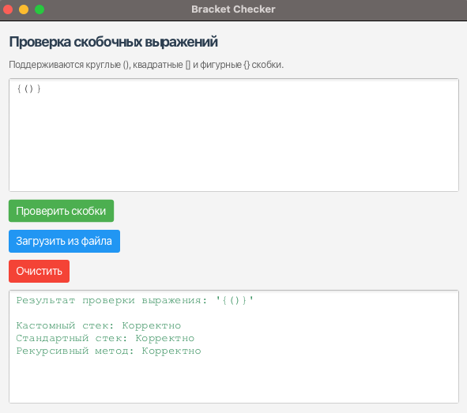

# Bracket Structure Checker (Stack/Queue Implementation)

This project implements a bracket structure validator for expressions with round `()`, square `[]`, and curly `{}` brackets. It provides three implementations: a custom stack using a linked list, Java's standard `Stack`, and a recursive approach without a stack. The application includes a JavaFX GUI for interactive testing and file input. Created as of 11:28 PM +04, May 28, 2025.

## Features
- **Custom Stack Implementation**: Uses `LinkedListStack` to validate bracket structures.
- **Standard Stack Implementation**: Uses Java's `Stack` class for validation.
- **Recursive Implementation**: Validates brackets without using a stack.
- **Interactive GUI**:
    - Input bracket expressions manually or load from a text file.
    - Displays results for all three methods (custom stack, standard stack, recursive).
    - Visual feedback with color-coded output (green for valid, red for errors).
    - Clear button to reset input/output.
- **Unit Tests**: Includes JUnit 5 tests for all implementations.

## Technologies
- Java 23
- JavaFX 24.0.1
- Maven
- JUnit 5

## How It Works
The application checks if a given bracket expression is valid by ensuring all opening brackets have matching closing brackets in the correct order. For example:
- Valid: `()`, `([]){}`, `((()){})`
- Invalid: `)(`, `((]`, `[{]}`

## How to Run
1. **Prerequisites**:
    - Install Java 23 (e.g., Amazon Corretto: [Adoptium](https://adoptium.net/)).
    - Download JavaFX 24.0.1 SDK for macOS aarch64: [GluonHQ](https://gluonhq.com/products/javafx/).
    - Install Maven.
2. Navigate to the project directory:
   ```bash
   cd stack-queue-brackets
   ```
3. Build the project:
   ```bash
   mvn clean install
   ```
4. Run the application:
   ```bash
   mvn javafx:run
   ```
5. Alternatively, run in IntelliJ IDEA with VM options:
   ```bash
   --module-path /Users/sergejpronin/javafx-sdk-24.0.1/lib --add-modules javafx.controls,javafx.fxml
   ```
6. Run unit tests:
   ```bash
   mvn test
   ```

## Project Structure
```
src/
├── main/java/ru/vsu/cs/course1/
│   ├── BracketChecker.java        # Custom stack implementation
│   ├── BracketCheckerStandard.java  # Standard Stack implementation
│   ├── BracketCheckerRecursive.java # Recursive implementation
│   ├── LinkedListStack.java       # Custom stack using linked list
│   ├── MainApp.java              # JavaFX GUI application
│   └── Node.java                 # Node class for LinkedListStack
├── test/java/ru/vsu/cs/course1/
│   └── AppTest.java              # Unit tests
img.png                           # Screenshot of the GUI
```

## Screenshots


## License
MIT License (see [LICENSE](LICENSE))

---

## Русский

Этот проект реализует проверку корректности скобочных выражений с круглыми `()`, квадратными `[]` и фигурными `{}` скобками. Включает три реализации: кастомный стек на основе связного списка, стандартный `Stack` из Java и рекурсивный подход без стека. Приложение предоставляет графический интерфейс на JavaFX для интерактивного тестирования и загрузки данных из файла. Создан по состоянию на 11:28 PM +04, 28 мая 2025 года.

### Возможности
- **Кастомный стек**: Использует `LinkedListStack` для проверки скобок.
- **Стандартный стек**: Использует класс `Stack` из Java.
- **Рекурсивный метод**: Проверка без использования стека.
- **Интерактивный GUI**:
    - Ввод выражений вручную или из файла.
    - Отображение результатов для всех трёх методов.
    - Цветовая индикация (зелёный для корректных, красный для ошибок).
    - Кнопка очистки.
- **Юнит-тесты**: JUnit 5 тесты для всех реализаций.

### Как запустить
1. Установите:
    - Java 23 (например, Amazon Corretto: [Adoptium](https://adoptium.net/)).
    - JavaFX 24.0.1 SDK для macOS aarch64: [GluonHQ](https://gluonhq.com/products/javafx/).
    - Maven.
2. Перейдите в папку проекта:
   ```bash
   cd stack-queue-brackets
   ```
3. Соберите проект:
   ```bash
   mvn clean install
   ```
4. Запустите приложение:
   ```bash
   mvn javafx:run
   ```